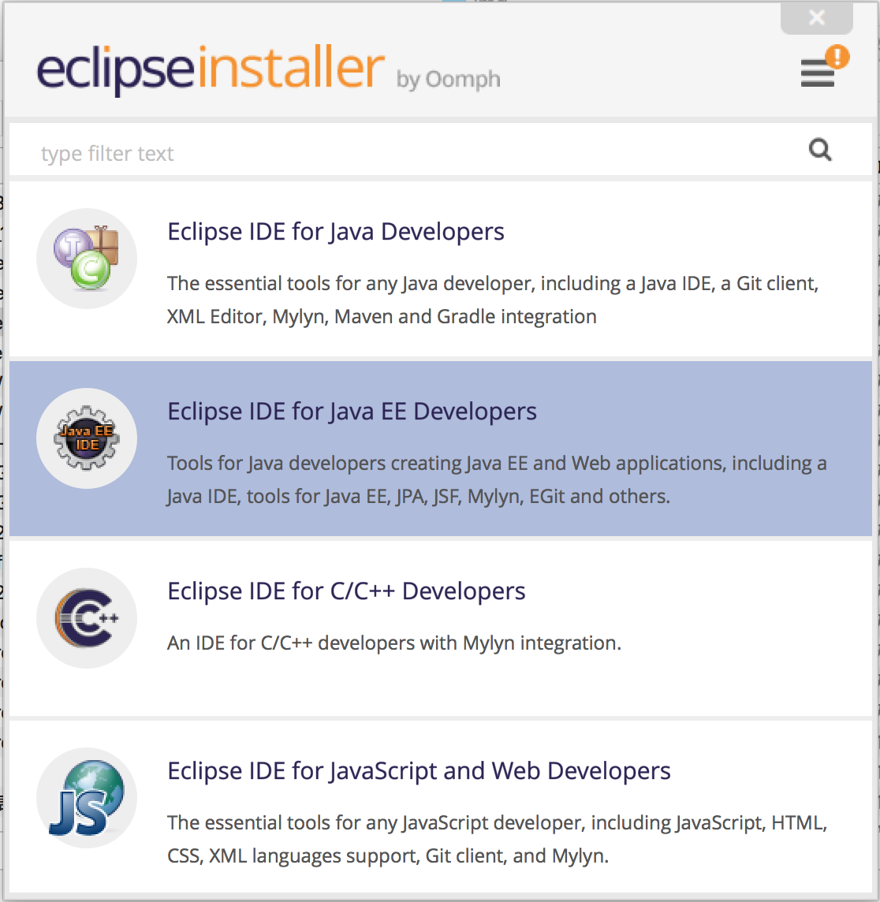
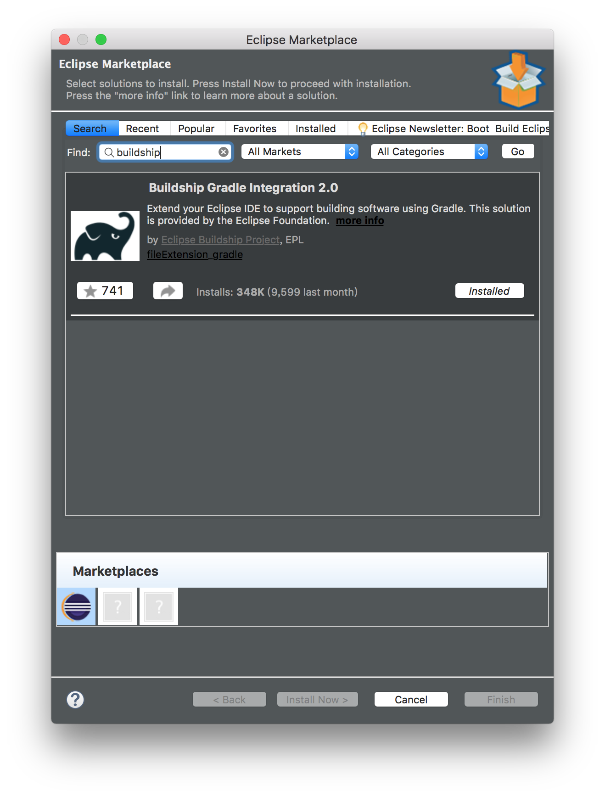
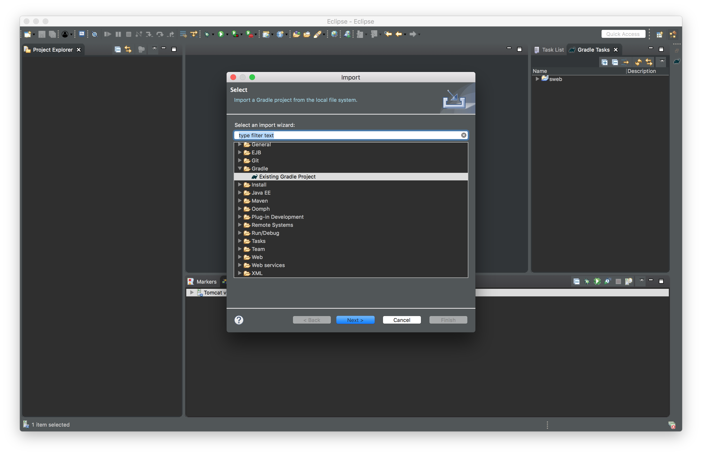
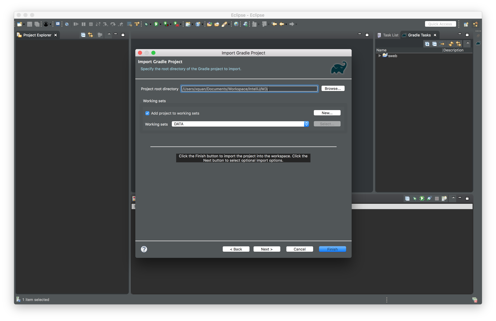
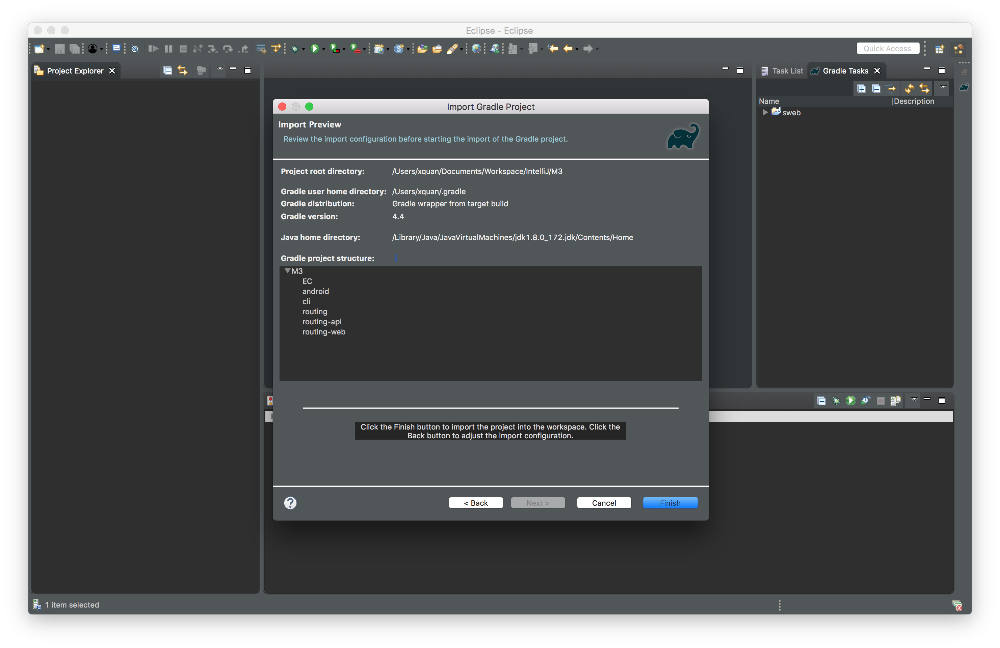
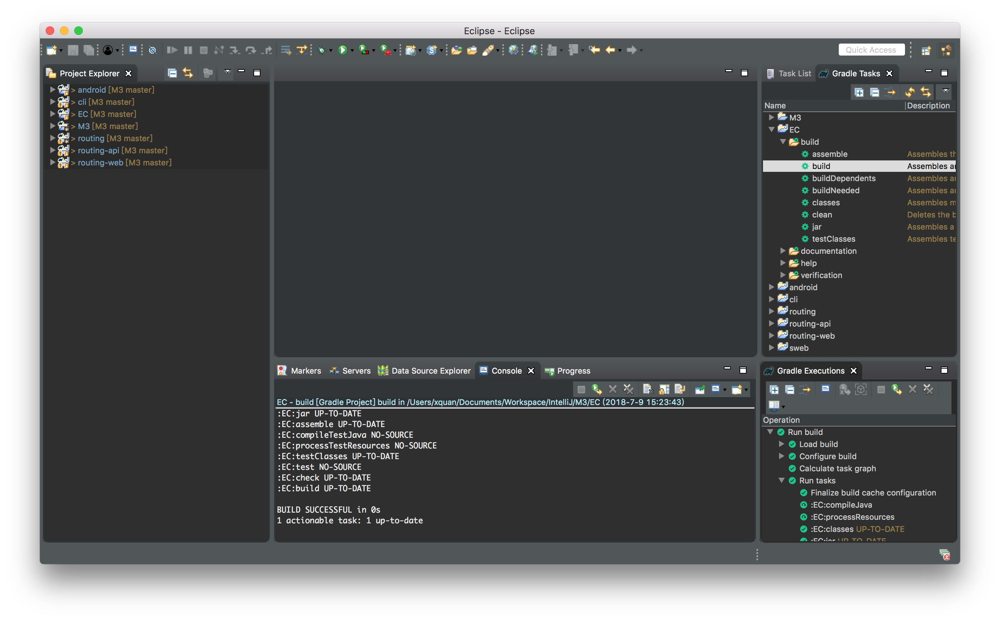
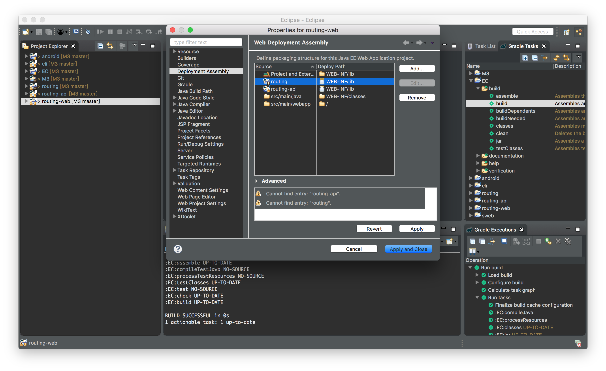
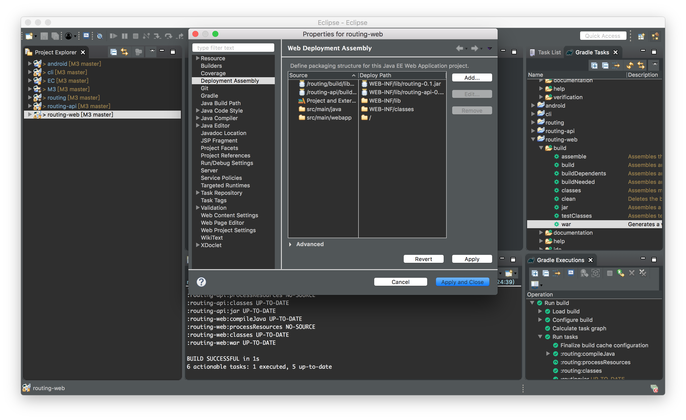
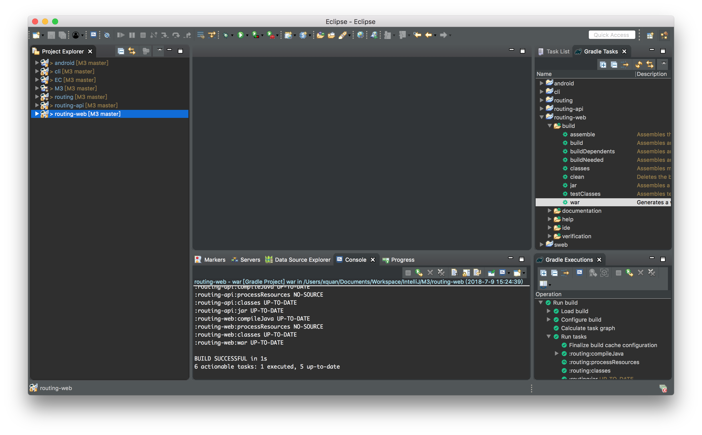

# Start With Eclipse

## Install IDE

Download Eclipse from its ([web site](https://www.eclipse.org/downloads/)) and then install.

In order to edit the web project, the Eclipse IDE for Java EE Developers should be installed.



Some older eclipse does not integrate with gradle plugin. so you should install the buildship plugin.



## Clone the Code

```
git clone https://github.com/BlockchainDATA/M3
```

## Import Project Into Eclipse

Open Eclipse , Select 'File->Import', Choose 'Existing Gradle Project'



You can move this project in to a working set to view them clearly.



Finish this import.



## Build the Project

Use gradle to build the whole project.
All jar files and war file will be generated.



## Develop the Web Project

To debug the web project with Eclipse WTP, some more config should be done.

In the web project's Properties Dialog, add the following jars to the project. 

Then when debug with WTP, the jars will automaticly build into the wars.




