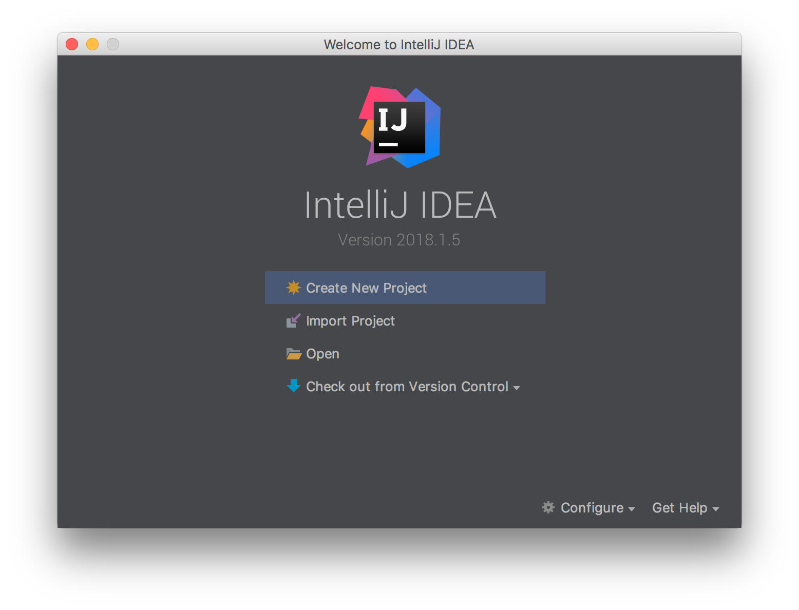
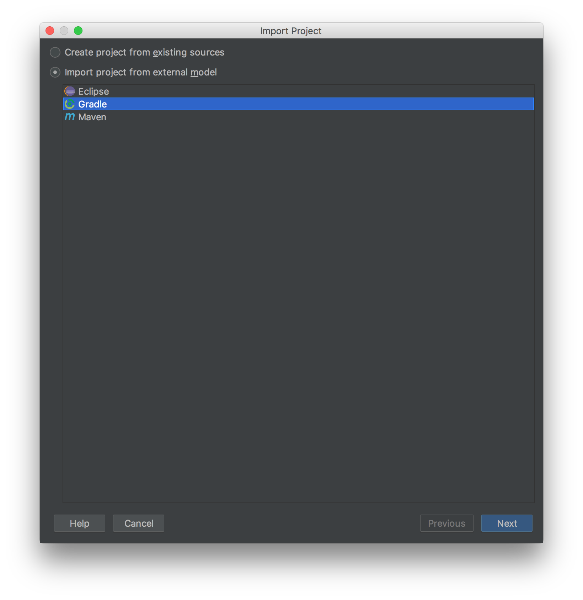
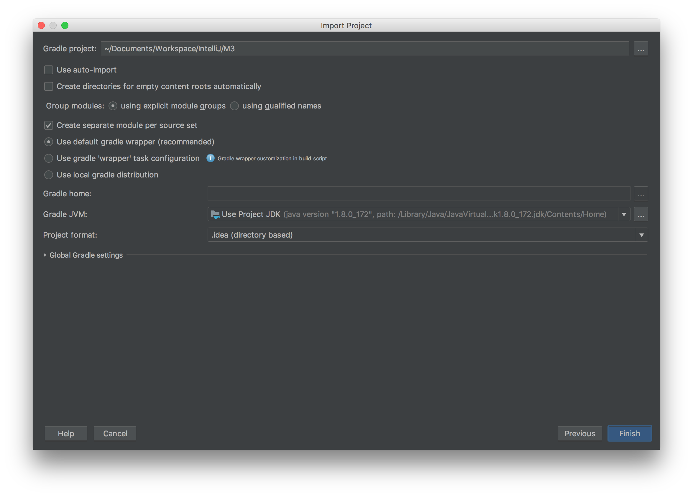
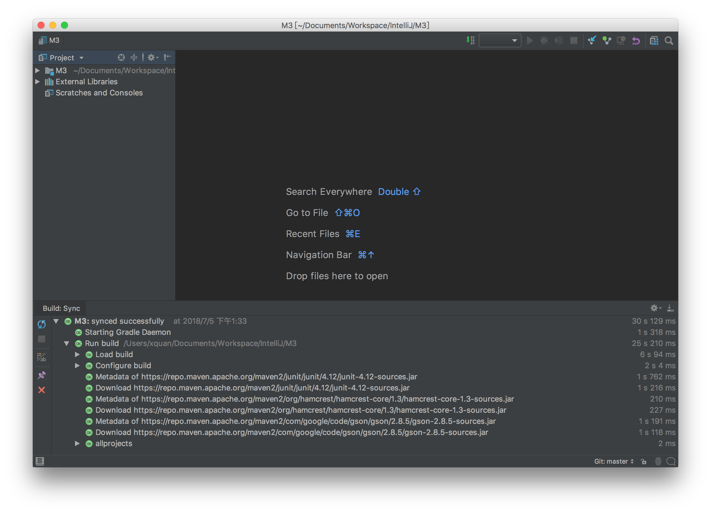

# Start With IntelliJ IDEA

## Install IDE

Download IntelliJ IDEA from its web site ([link](http://www.jetbrains.com/idea/)) and then install.

The community version is enough for library developing.

For android development, you should install the android plugin.

### Clone the Code

```
git clone https://github.com/BlockchainDATA/M3
```

### Import Project Into IntelliJ

Open IntelliJ , Select 'Import Project'



Import Project, Use Gradle Model



Select Project Path already Cloned into.



### Build with Gradle

IntelliJ Will auto build the project in a few minutes.
When first build, the IDE will take minutes to download gradle and some dependency libraries from network.


You can then select "View->Tool Windows->Gradle" to open gradle view and rebuild the project.