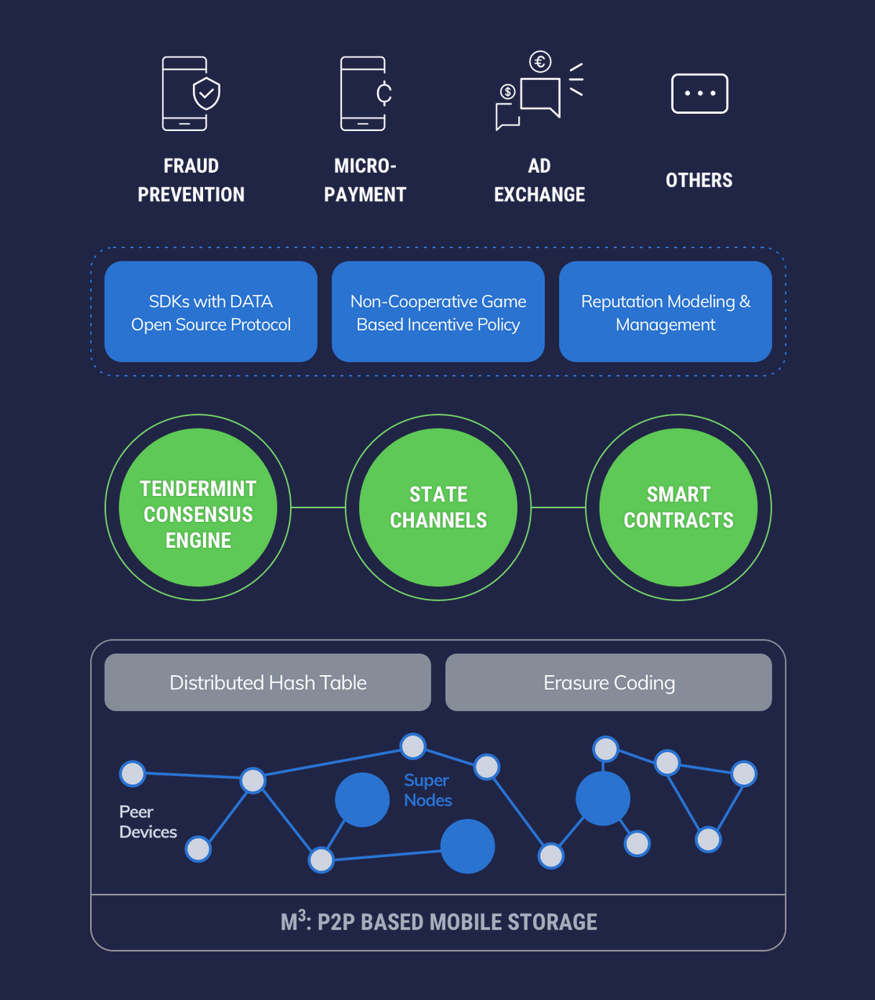

# Overview

M3 Project is designed for P2P Based Mobile Storage.

It's part of the DATA technology stack.

Here is the system overview of DATA.

DATA technology stack is composed of four layers.

More info of DATA Project can be found at [Data's Official Site](http://data.eco/)