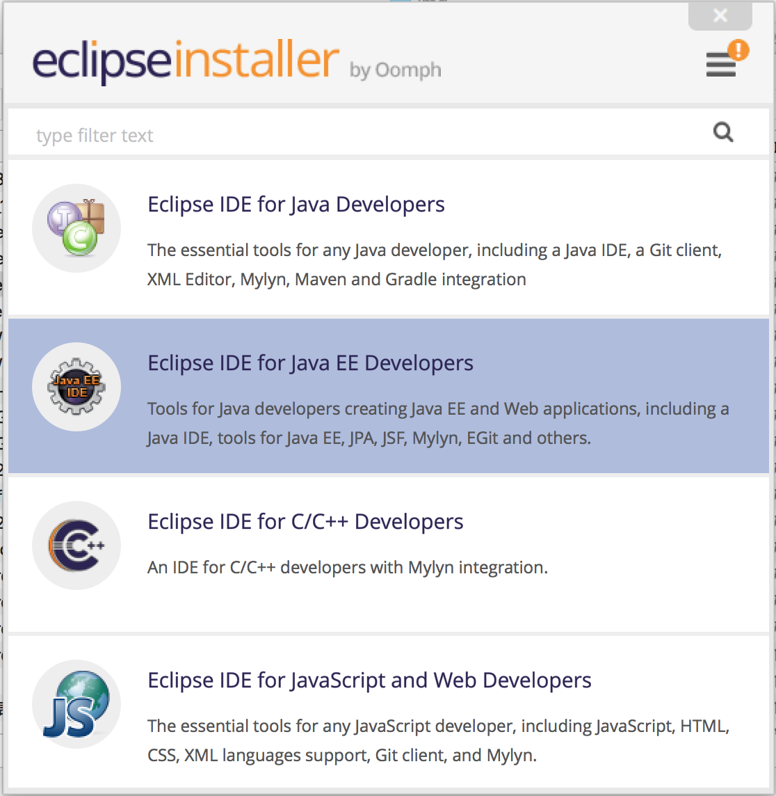
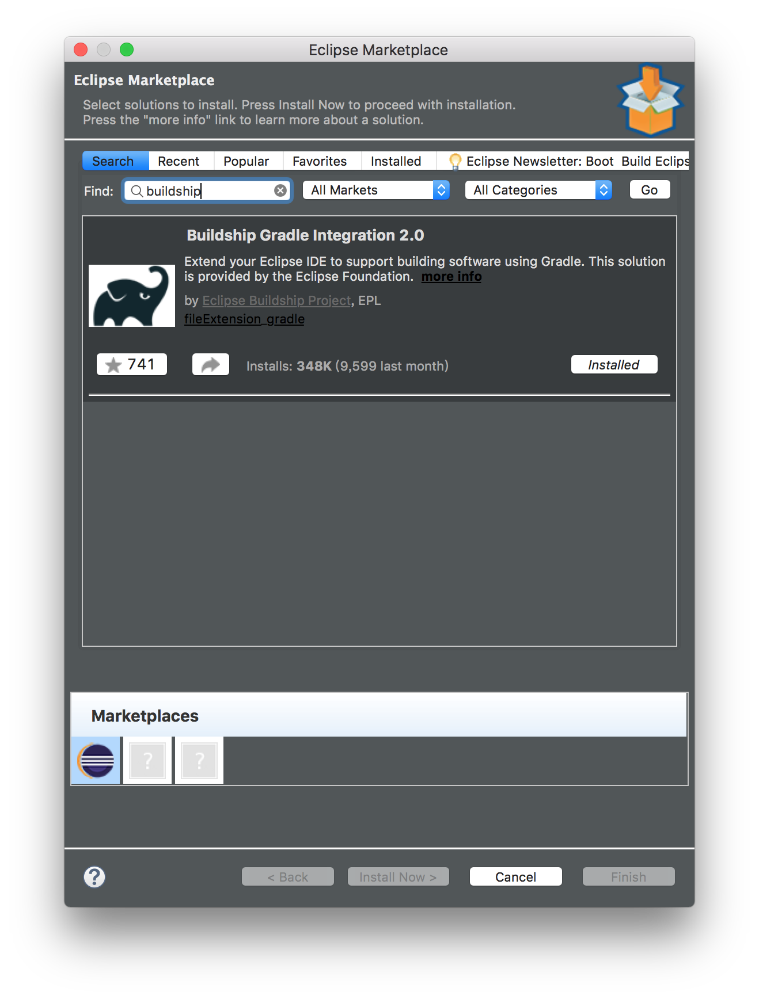
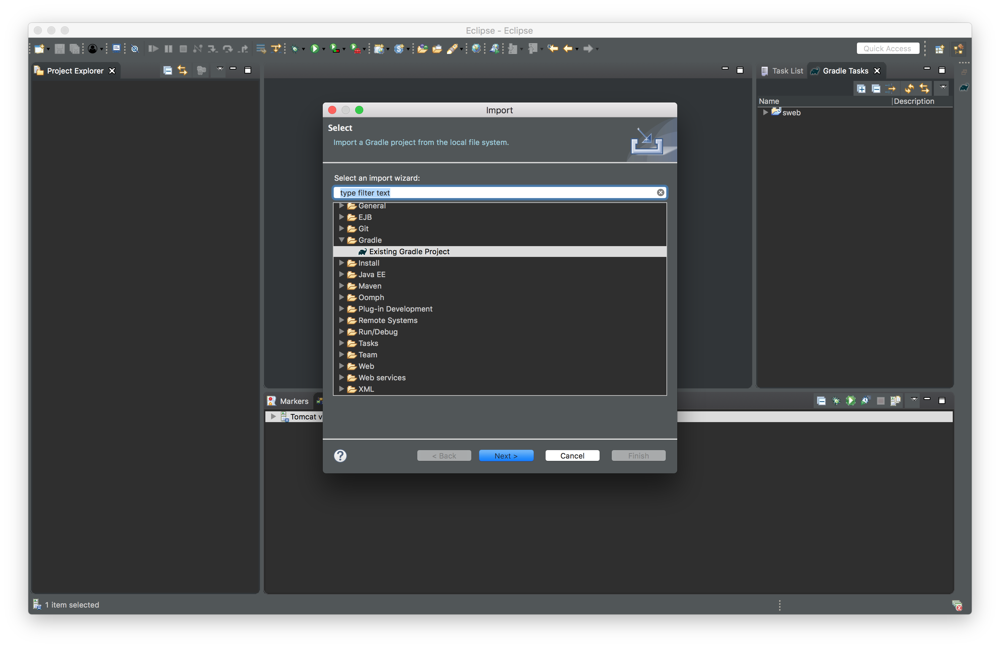
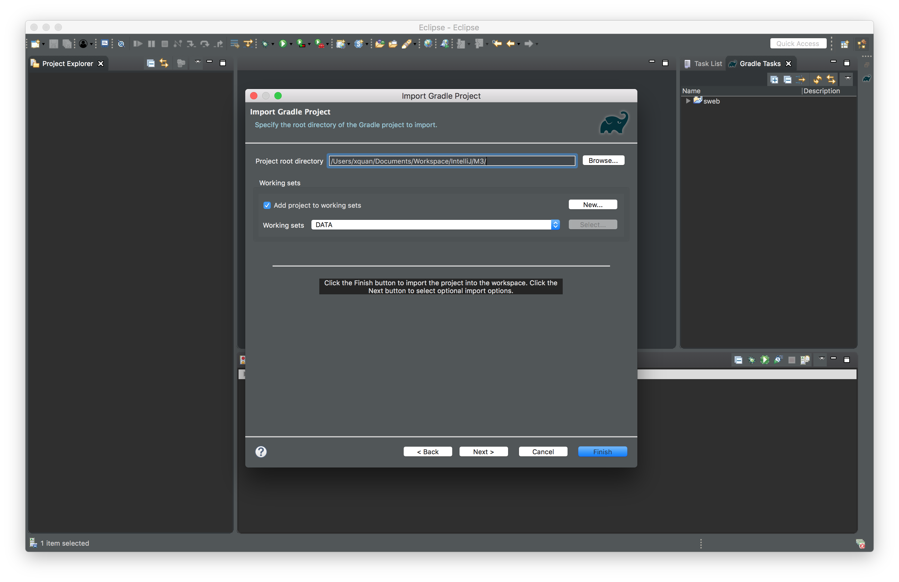
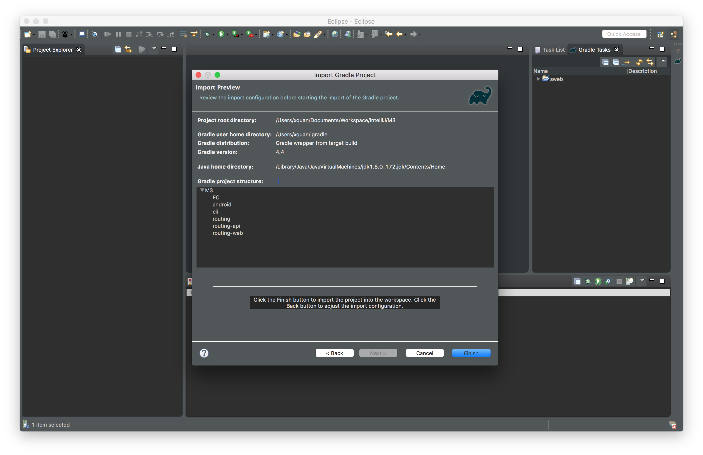
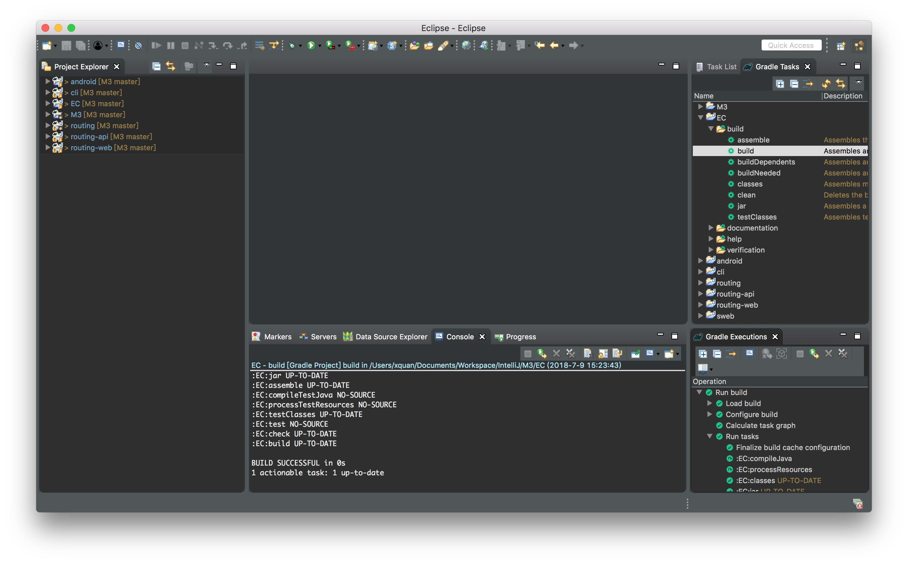
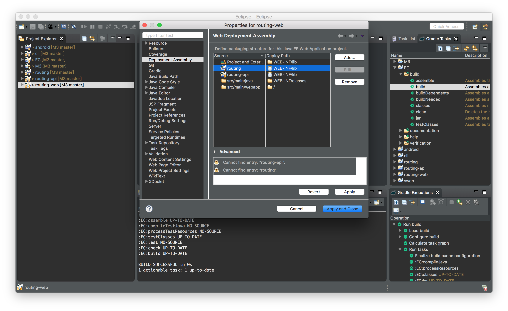
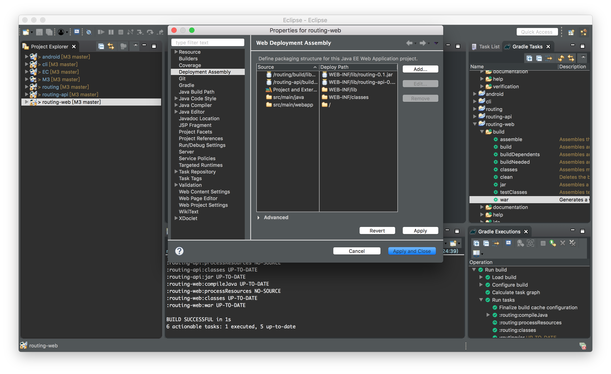
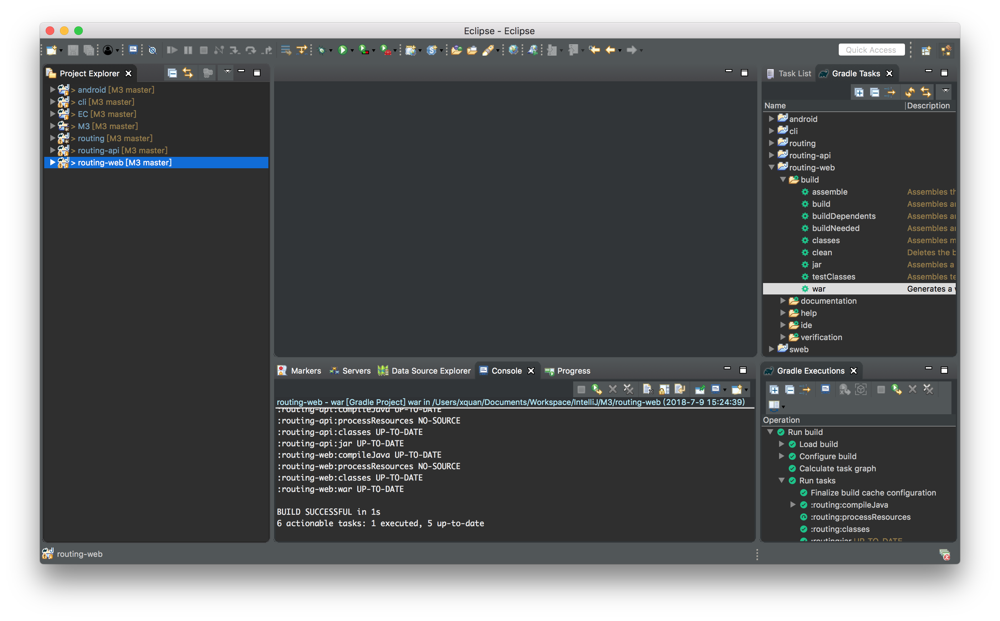

# 使用Eclipse开发

## 安装IDE

从([eclipse官网](https://www.eclipse.org/downloads/)) 下载并安装。

由于要开发web项目，需要安装‘Eclipse IDE for Java EE Developers’版本。



早期版本的Eclipse并未集成gradle插件，所以需要手动安装buildship插件。



## Clone 代码

```
git clone https://github.com/BlockchainDATA/M3
```

## 导入项目到Eclipse

打开Eclipse，选择'File->Import'，在对话框中选择'Existing Gradle Project'



可以将即将导入的项目移入工作集中以方便管理。



完成导入。



## 编译项目

使用gradle来编译整个项目。
相关jar和war文件会自动生成。



## 调试web项目

为了能够使用Eclipse WTP来进行项目调试，需要进一步进行设置。
中web项目的属性对话框中，将下列的jar文件加入到项目中来。
稍后即可直接利用WTP调试整个项目。




