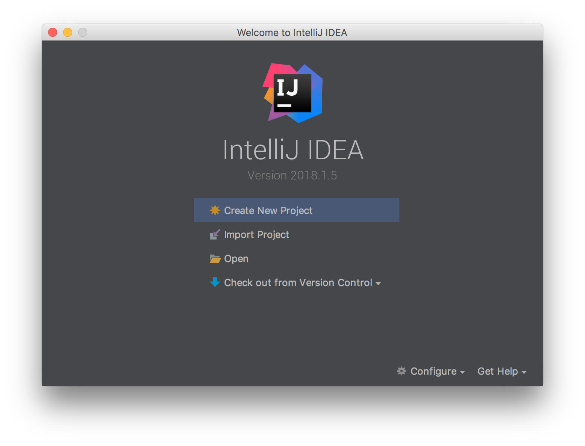
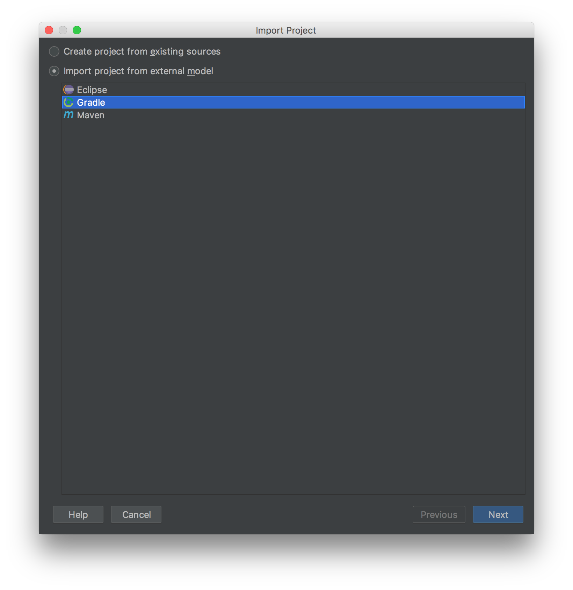
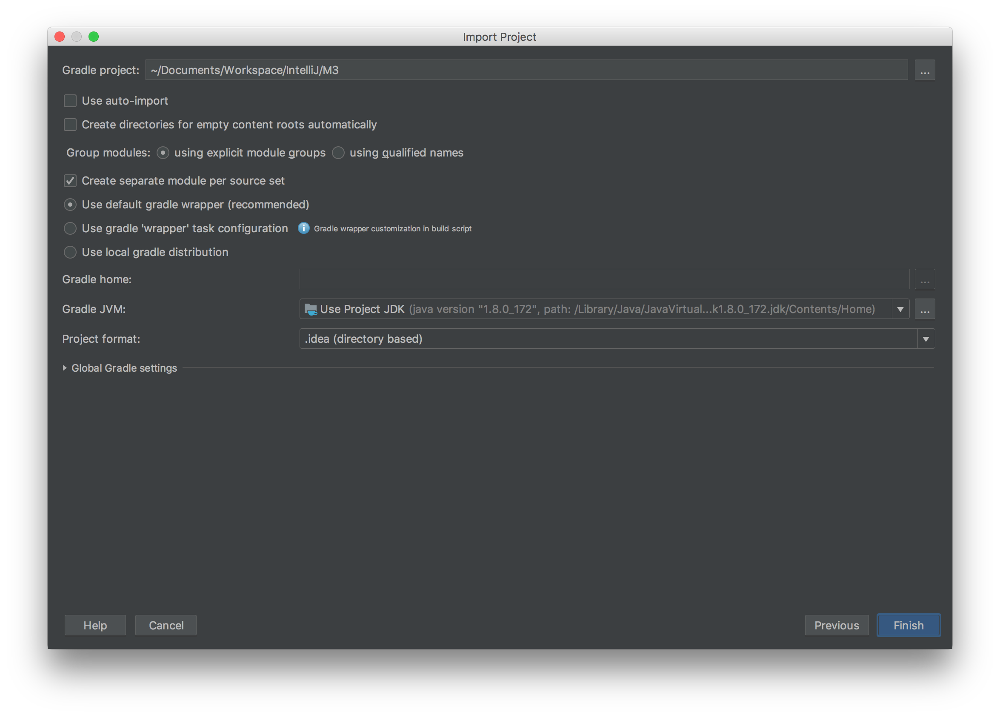
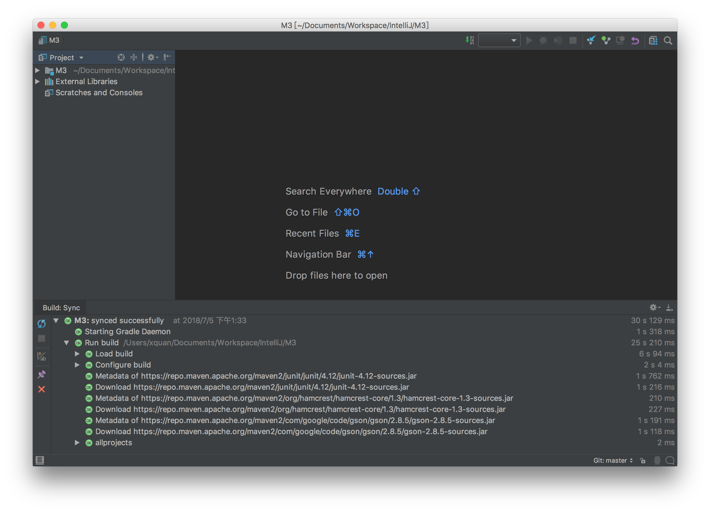

# 使用IntelliJ IDEA开发

## 安装IDE

从IntelliJ IDEA([官方网站](http://www.jetbrains.com/idea/)) 下载并安装。

社区版本包含了进行项目开发的主要功能。

如要进行android开发，需要安装android插件

### Clone 代码

```
git clone https://github.com/BlockchainDATA/M3
```

### 导入项目到IntelliJ中

打开IntelliJ，选择'Import Project'导入项目



导入项目后, 选择 Gradle Model



选择项目路径



### 使用Gradle进行导入

IntelliJ会花费几分钟自动进行项目编译。
第一次编译时，由于需要下载gradle等依赖库需要花费较长时间。


稍后可以选择 "View->Tool Windows->Gradle"打开Gradle视图并进行编译。