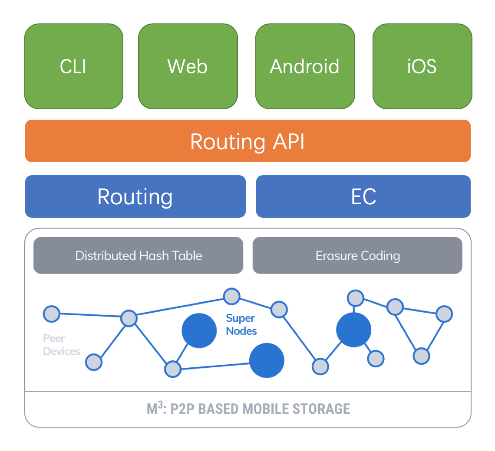

# M3

M3 项目是DATA项目分布式移动存储模块。
这里描述了整个项目的文件结构。

## 项目结构

### routing

底层核心网络库，用于完成DHT分布式网络通信。

### routing-api

基础API，提供网络节点的操作及文件收发。

### EC

M3的纠错编码模块

### web

一个Web应用，使得能够部署M3节点在Web容器中。

### cli

一个操作routing节点的命令行工具

### android

一个android示例项目，展示了如何在android中使用M3项目的API。

### ios

一个iOS示例项目，展示了如何在android中使用M3项目的API。
TODO
